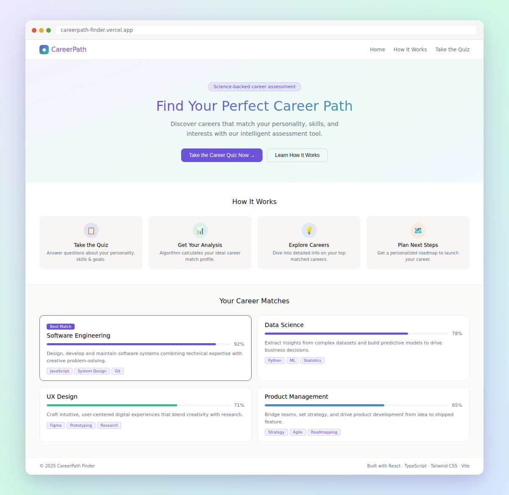

<div align="center">


<br/>

[](https://react.dev/)
[](https://www.typescriptlang.org/)
[](https://tailwindcss.com/)
[](https://vitejs.dev/)
[](LICENSE)

<br/>

<a href="https://careerpath-finder.vercel.app">
  
</a>
&nbsp;
<a href="https://github.com/SubhuPanda21/careerpath/stargazers">
  
</a>
&nbsp;
<a href="https://github.com/SubhuPanda21/careerpath/network/members">
  
</a>

<br/><br/>

> *Most people **stumble** into a career. CareerPath makes sure you **choose** yours.*

</div>

---

## 🖥️ Preview

<div align="center">
<br/>

<br/><br/>
</div>

---

## 🌟 What is CareerPath?

**CareerPath** is a fast, science-backed career assessment built with React + TypeScript. Answer a short personalised quiz, get ranked career matches with percentage fit scores, and explore curated learning resources and step-by-step action roadmaps — all client-side, no backend required.

---

## ✨ Features

<table>
<tr>
<td width="50%">

🧠 **Smart Quiz Engine**
Multi-category questions on personality, skills, interests & goals — every answer secretly carries weighted career scores.

</td>
<td width="50%">

📊 **Weighted % Match Scores**
Accumulated scores are normalised and ranked so you always see your most compatible careers first.

</td>
</tr>
<tr>
<td width="50%">

💼 **12+ Career Paths**
Software Eng · Data Science · UX/UI · Digital Marketing · Finance · Legal · Healthcare · Cybersecurity & more.

</td>
<td width="50%">

📚 **Curated Learning Resources**
Every career card ships with hand-picked courses, communities, certifications and job boards.

</td>
</tr>
<tr>
<td width="50%">

🗺️ **Personalised Roadmaps**
Step-by-step action plans customised to your top career match — from day one to landing the role.

</td>
<td width="50%">

🌙 **Dark Mode · 📱 Responsive**
Fully theme-aware, looks stunning on any device, any screen size, any time of day.

</td>
</tr>
</table>

---

## 🏗️ Tech Stack

```
  ╭──────────────────────────────────────────────────────────────╮
  │                    ✦  CAREERPATH STACK  ✦                    │
  ├────────────────────┬─────────────────────────────────────────┤
  │  ⚛️  React 18       │  Component-driven UI + Hooks            │
  │  🔷  TypeScript 5.5 │  Full static typing, zero `any`         │
  │  🎨  Tailwind 3.4   │  Utility-first, responsive styling      │
  │  ⚡  Vite 5.4       │  Lightning HMR + optimised builds       │
  │  🔗  React Router 6 │  Client-side SPA routing                │
  │  🖼️  Lucide React   │  Clean, consistent icon system          │
  │  🧠  Context API    │  Lightweight global state management     │
  ╰────────────────────┴─────────────────────────────────────────╯
```

---

## 📁 Project Structure

```
📦 careerpath/
│
├── 📂 src/
│   ├── 📂 components/
│   │   ├── 🏠 home/
│   │   │   ├── Hero.tsx              ← Gradient hero + CTA buttons
│   │   │   ├── HowItWorks.tsx        ← 4-step explainer cards
│   │   │   ├── Testimonials.tsx      ← Social proof section
│   │   │   └── CallToAction.tsx      ← Bottom CTA strip
│   │   ├── 📝 quiz/
│   │   │   ├── QuizQuestion.tsx      ← Question + answer options
│   │   │   ├── ProgressBar.tsx       ← Animated progress indicator
│   │   │   └── EmailCapture.tsx      ← Optional email gate
│   │   └── 🏆 results/
│   │       ├── CareerCard.tsx        ← Match % + expandable detail
│   │       └── ActionSteps.tsx       ← Personalised roadmap steps
│   ├── 📂 context/
│   │   ├── 🧠 QuizContext.tsx        ← State + weighted scoring engine
│   │   └── 🌙 ThemeContext.tsx       ← Dark / light mode
│   ├── 📂 data/
│   │   ├── 📋 quizData.ts            ← Questions with career weight maps
│   │   └── 💼 careerData.ts          ← Career DB: skills · courses · jobs
│   └── 📂 pages/
│       ├── Home.tsx
│       ├── Quiz.tsx
│       └── Results.tsx
│
├── 🖼️  assets/preview.png
├── 🎨  tailwind.config.js
├── ⚡  vite.config.ts
└── 📦  package.json
```

---

## 🚀 Getting Started

```bash
# 1. Clone
git clone https://github.com/your-username/careerpath.git && cd careerpath

# 2. Install
npm install

# 3. Run  →  http://localhost:5173
npm run dev

# 4. Build for production
npm run build
```

---

## 🧠 How the Scoring Algorithm Works

Each quiz answer carries **weighted affects** — a map of career IDs to point values. After all questions, scores are normalised to a percentage and ranked highest-first.

The quiz covers 4 categories: **Personality · Skills · Interests · Goals** — each dimension contributes differently to each career, producing a genuinely personalised match.

---

## 🗺️ Roadmap

```
  SHIPPED ────────────────────────────────────────── COMING SOON

  ✅  Core quiz engine               🔜  User auth + saved results
  ✅  Weighted scoring algorithm     🔜  50+ career profiles
  ✅  Career match % cards           🔜  AI-powered advisor chat
  ✅  Curated learning resources     🔜  Social share cards
  ✅  Action step roadmaps           🔜  Career comparison tool
  ✅  Dark mode + Responsive UI      🔜  Mobile app (React Native)
```

---

## 🤝 Contributing

```bash
git checkout -b feature/your-brilliant-idea
git commit -m "feat: ✨ your brilliant idea"
git push origin feature/your-brilliant-idea
# → Open a Pull Request 🚀
```

All contributions welcome — new careers, UI polish, bug fixes, or bold new features!

---

## 📄 License

Distributed under the **MIT License** — see [`LICENSE`](LICENSE) for details.

---

<div align="center">


**Made with ❤️ and ☕ by [Subhalaxmi Panda](https://github.com/SubhuPanda21)**

*If CareerPath helped you find your direction — a ⭐ star means the world!*

</div>
